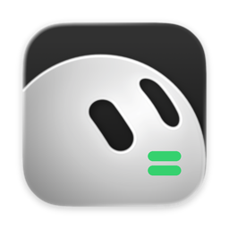

<p align="center">
  
</p>

<h1 align="center">GrokBotEater</h1>

<p align="center">
  <strong>Monitor your Grok Bot (Cursor) weekly usage from the macOS menu bar.</strong>
  <br />
  <sub>A separate product forked from <a href="https://github.com/AThevon/TokenEater">TokenEater</a> by Adrien Thevon. For Claude Code usage, keep using upstream TokenEater.</sub>
</p>

<p align="center">
  <a href="https://github.com/EmersonSpiff/GrokBotEater">Repository</a> ·
  <a href="#install">Install</a> ·
  <a href="#what-you-get">Features</a> ·
  <a href="#privacy">Privacy</a> ·
  <a href="https://github.com/EmersonSpiff/GrokBotEater/releases">Releases</a>
</p>

<p align="center">
  
  
  
  
</p>

---

> **Separate product (TokenEater fork)**  
> GrokBotEater tracks **Grok Bot** weekly sand-usage via Cursor’s `get-sand-usage-status` API.  
> Bundle IDs, shared data paths, and Sparkle are isolated so you can run it **alongside** TokenEater.  
> Full credit to [Adrien Thevon](https://github.com/AThevon) for the original architecture.

## What you get

A native menu bar app and WidgetKit widget for **Grok Bot** weekly usage on your Cursor plan.

- **Menu bar.** Live Grok Bot weekly % with your Canva face / logo and color-coded thresholds.
- **Studio popover.** Grok Bot gauge as the default surface (Claude 5h / Weekly / Watchers pruned from the add menu).
- **Widget.** **Grok Bot Usage** (small + medium) reading a local shared snapshot — no network in the extension.
- **Connect.** Sign in with your Cursor web session (`WorkosCursorSessionToken`); IDE `state.vscdb` fallback when available.
- **Settings → Connection.** Re-check uses the Grok Bot / Cursor session, not Claude OAuth.

**Status (2026-09-21):**

- ✅ Grok Bot API client + session auth (Keychain + IDE fallback)
- ✅ `GrokBotUsageStore` auto-refresh + shared snapshot for WidgetKit
- ✅ Menu bar face + Grok-first Studio composition
- ✅ **Grok Bot Usage** widget (build 515+)
- ✅ History tab placeholder (“Coming soon” for Grok trends)
- 🚧 Grok-native notifications / Watchers (Claude-shaped leftovers deferred)
- 🚧 Signed DMG / Homebrew distribution

**Not this app:** Claude 5h/7d tracking, Claude Code JSONL history, and Agent Watchers belong in [TokenEater](https://github.com/AThevon/TokenEater). Run both if you need both.

## Install

### Build from source (required for now)

No DMG or Homebrew bottle yet.

```bash
git clone https://github.com/EmersonSpiff/GrokBotEater.git
cd GrokBotEater
./build.sh
```

**Prerequisites:**

- macOS 14+
- Xcode 15+ (Swift 5.9)
- XcodeGen (`brew install xcodegen`)

The build produces an unsigned `GrokBotEater.app` (right-click → Open on first launch).  
Step-by-step: [`SETUP.md`](SETUP.md).

### First setup

1. Launch GrokBotEater and use **Connect** if usage doesn’t appear (Cursor web session).
2. Usage refreshes on an interval (default ~5 minutes).
3. Add the desktop widget: Notification Center → **GrokBotEater** → **Grok Bot Usage** (not TokenEater’s Overview widgets).
4. Open the app once after install so the shared snapshot syncs.

## Privacy

GrokBotEater is **read-only** for Grok Bot:

- `POST https://cursor.com/api/dashboard/get-sand-usage-status` with your Cursor session cookie
- Returns weekly `usagePercent` (and related plan flags used for ring gating)
- No writes, no account changes

The WidgetKit extension only reads  
`~/Library/Application Support/com.emersonspiff.grokboteater.shared/shared.json`.

**Session security:** Prefer the in-app Connect flow (cookie stored in this app’s Keychain service). Disk scrapes of Cursor/Chrome cookie DBs are a fallback only. Revoke by logging out at [cursor.com](https://cursor.com) or clearing Connect in Settings.

**Source audit:**  
[`GrokBotAPIClient.swift`](Shared/Services/GrokBotAPIClient.swift),  
[`GrokBotSessionStore.swift`](Shared/Services/GrokBotSessionStore.swift),  
[`CursorCookieReader.swift`](Shared/Services/CursorCookieReader.swift),  
[`CursorIDETokenReader.swift`](Shared/Services/CursorIDETokenReader.swift)

## Update

Sparkle auto-update is neutralized so this fork doesn’t collide with upstream TokenEater. Rebuild from this repo for new builds.

## Uninstall

```bash
rm -rf /Applications/GrokBotEater.app
rm -rf ~/Library/Application\ Support/com.emersonspiff.grokboteater.shared
```

## Documentation

- [Setup](SETUP.md) — build from source
- [Troubleshooting](docs/TROUBLESHOOTING.md)
- [Contributing](CONTRIBUTING.md)
- [AGENTS.md](AGENTS.md) — architecture notes for contributors / agents
- [Design system](docs/design/MASTER.md)

## Contributing

Bug reports and Grok Bot integration improvements welcome. See [`CONTRIBUTING.md`](CONTRIBUTING.md).

## Upstream & Credits

**GrokBotEater** is a fork of **[TokenEater](https://github.com/AThevon/TokenEater)** by [Adrien Thevon](https://athevon.dev).  
Core menu-bar / widget architecture comes from TokenEater; this product renames the bundle and focuses on Grok Bot.

- **Claude usage** → [TokenEater](https://github.com/AThevon/TokenEater)  
- **Grok Bot weekly usage** → this repo

## License

MIT (same as upstream TokenEater)

---

<p align="center">
  Maintained by <a href="https://github.com/EmersonSpiff">EmersonSpiff</a>.
  <br />
  <sub>
    Original TokenEater by <a href="https://athevon.dev"><strong>Adrien Thevon</strong></a>.
  </sub>
</p>
